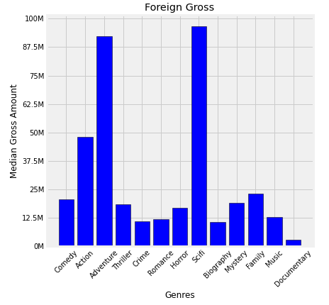
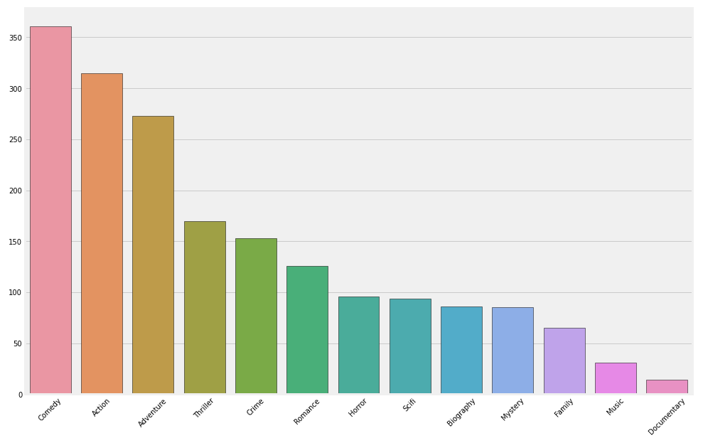
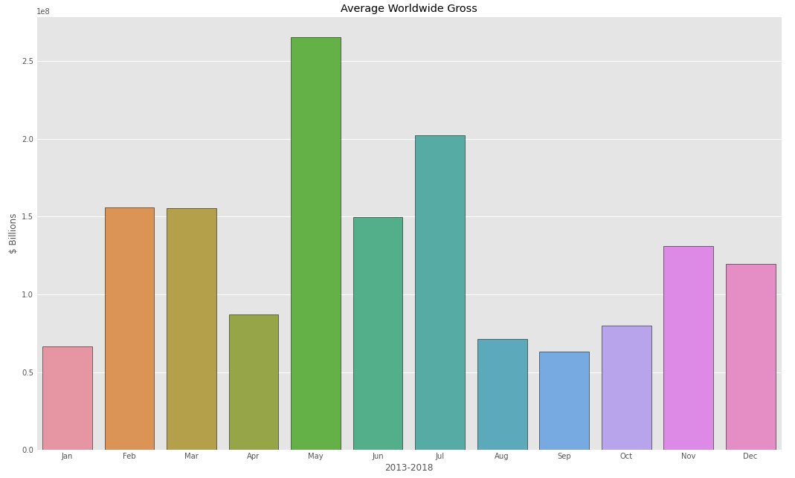
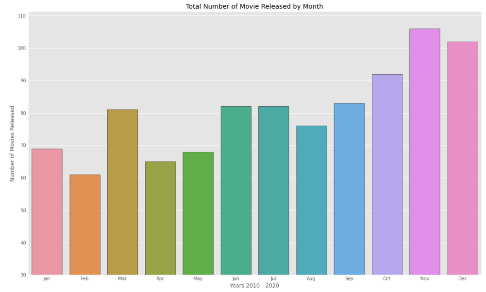

# Microsoft Movie Analysis

**Authors**: Doug Mill, Carlos McCrum, Seung Lee

## Overview

What Better Way To Launch Microsoft's New Movie Other Than An Original Blockbuster Series?!

Task: Inform Microsoft on how they can premier their first movie successfully. We investigated past movies to see what made the most money and how we can replicate them. We broke down those movies into these categories: What genres are selling, how much money are they spending, and when is the right time to release our movie?


## Business Problem

Microsoft is looking to launch a movie, however they are unsure of the space. We are here to help visualize what types of movies have been doing well historically and how Microsoft can replicate such success.

By creating our own series, we can create more loyal and dedicated fans, but we must do it right. We first looked through the different genres to see what films attact people and narrow down their interest. We look to the seasons to determine if there is an ideal time to release our movie (High demand for movies and Competition) 

## Data

The dataset we are using (BigFrame) is derived from 'bom.movie_gross.csv', 'imdb.title.basics.csv', and 'tn.movie_budgets.csv'

BigFrame contains the columns 'release_date', 'movie', 'production_budget', 'worldwide_gross', 'foreign_gross', 'year', 'runtime minutes', and 'genres'. These columns should help us find out the formula to a great movie launch, if there is such a method.


## Methods

We first prepared the BigFrame by combining all the necessary tables together using a common attribute ('movie'). Next we dropped all unnecessary columns and removed any duplicate entries. We then created two columns 'month' and 'year' in order to manipulate the data using time. Lastly, we dropped the rows with missing data which left us with BigFrame of 977 rows. 


## Results

Releasing our film during May is ideal. History has shown that May returns the greatest revenue income for large production movies. With other movie competition not being so high in the beginning half of the year, May presents itself as the most ideal opportunity to debut our blockbuster film.

### How Well Does Each Genre Perform?
 

Genres 'Adventure' and 'Sci-fi' returns the highest median gross for movies within our dataset. 'Family' does well domestically, but not too well internationally. 'Action' is also a consistent genre that performs better than average.

### Total Number of Genres Released for Each Genre

Not many production companies are creating Sci-fi films even though they are in high demand. This creates the perfect opportunity for our team.

### Seasonal Average Worldwide Gross Income

May is historically the best month for large movie productions. Could be due to summer time and people going on vacations / more free time. Or perhaps because the hot weather encourages more indoor activies. Regardless, summer time is especially attractive time to release our film.

### Number of Movies Released Each Month

Combined with the relatively low volume, there is no better time in the year.


## Conclusions

Any skepticism in our data or how we could further explore our dataset (more potentially relevant comparisons)

Sample was 967 movies, ideally we would want that number to be larger.

Go further in depth about how much Sci-Fi and Adventure movies are spending (production_budget) in order to get good returns as shown in Visual 1.

***
Questions to consider:
* What would you recommend the business do as a result of this work?
* What are some reasons why your analysis might not fully solve the business problem?
* What else could you do in the future to improve this project?
***

## For More Information

Please review our full analysis in [our Jupyter Notebook](./dsc-phase1-project-template.ipynb) or our [presentation](./DS_Project_Presentation.pdf).

For any additional questions, please contact **name & email, name & email**

## Repository Structure

Describe the structure of your repository and its contents, for example:

```
├── README.md                           <- The top-level README for reviewers of this project
├── dsc-phase1-project-template.ipynb   <- Narrative documentation of analysis in Jupyter notebook
├── DS_Project_Presentation.pdf         <- PDF version of project presentation
├── data                                <- Both sourced externally and generated from code
└── images                              <- Both sourced externally and generated from code
```
