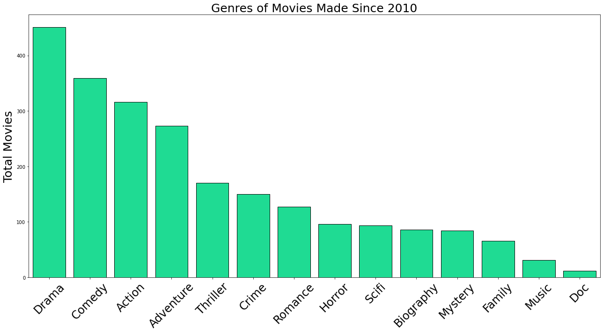
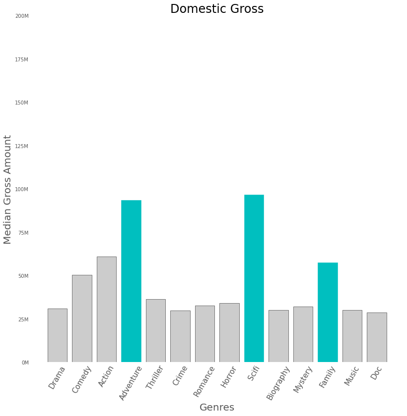
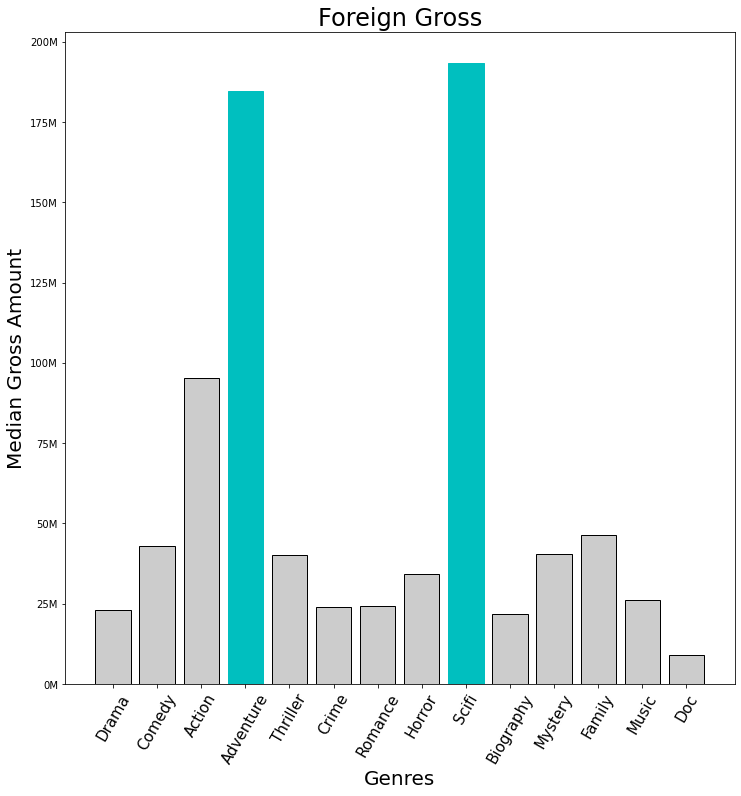
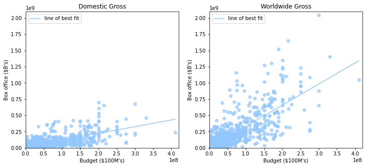
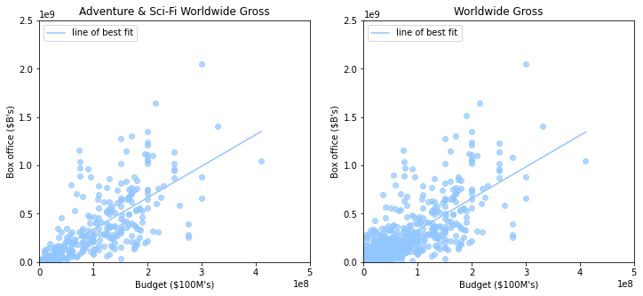
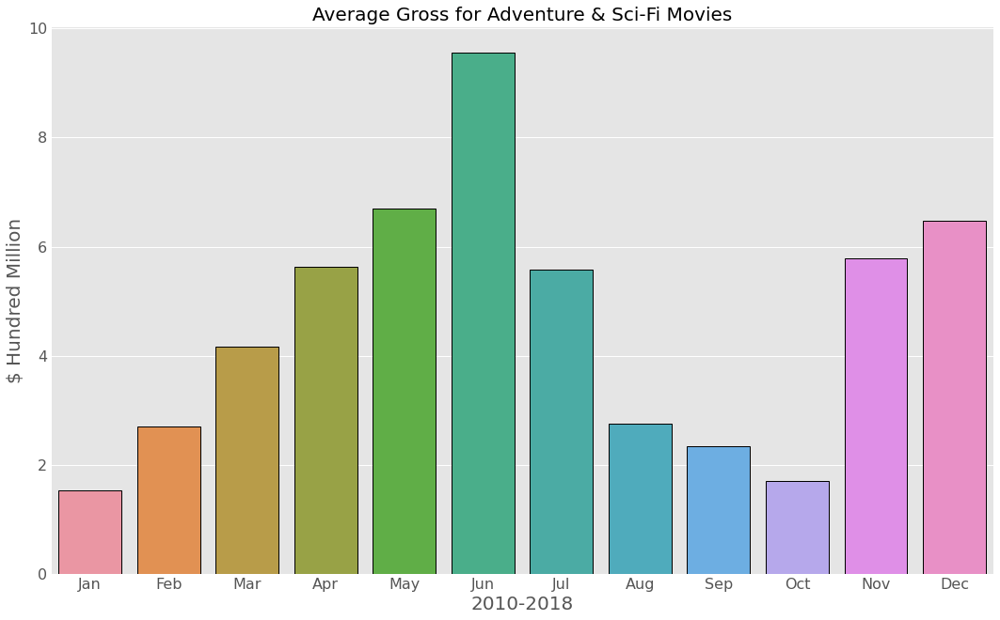
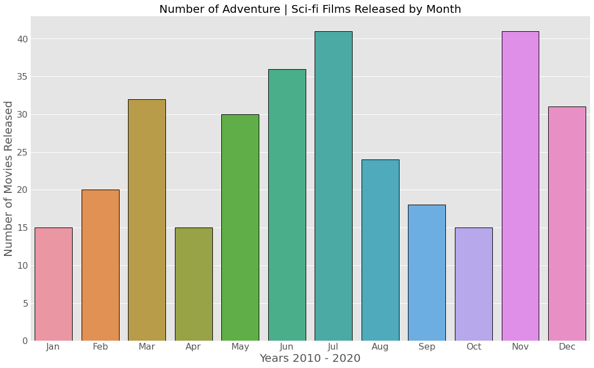

# Microsoft Movie Optimization Unit

**Authors**: Doug Mill, Carlos McCrum, Seung Lee

## What Better Way To Launch Microsoft's New Movie Other Than An Original Blockbuster Series?!

Task: Inform Microsoft on how they can premier their first movie successfully. We investigated past movies to see what made the most money and how we can replicate them. We broke down those movies into these categories: What genres are selling, how much money are they spending, and when is the right time to release our movie?


## Business Problem

Microsoft is looking to launch a movie, however they are unsure of the space. We are here to help visualize what types of movies have been doing well historically and how Microsoft can replicate such success.

By creating our own series, we can create more loyal and dedicated fans, but we must do it right. We first looked through the different genres to see what films attact people and narrow down their interest. Then we wanted looked at the correlation to production budget to gross income, if there was a correlation. Lastly, we look to the seasons to determine the most ideal time to release our movie. 

## Data

The dataset we are using (BigFrame) is derived from 'bom.movie_gross.csv' (Box Office Mojo), 'imdb.title.basics.csv' (IMDb), and 'tn.movie_budgets.csv' (The Numbers).

The data we will be working with will be production budget, release date, domestic gross, foreign gross, and worldwide gross.

This dataset should give us a good idea of what other large scale movie companies have been doing for to maintain their success.


## Methods

We first prepared the BigFrame by combining all the necessary tables together using a common attribute ('movie'). Up next was to make the data fit our criteria: successful, not indie movie, and recent 10 years.
To do this, we filtered out the rows with < $1,000,000 worldwide gross income and < $1,000,000 production budget. Lastly was to filter our data to retrieve data to 2010. 

To do this, created two columns 'month' and 'year' in order to manipulate the data using time. 'month' to sort the data by seasons within the calender year, and 'year' to sort by the recent timeframe (10years).

Finally, we dropped all unnecessary columns,removed any duplicate entries, and removed rows with NULL values. 

Final dataset N = 317

## Results

Looking at our results, our recommendation is a well funded (> $100,000,000) Sci-fi / Adverture movie, set to be released in May. 

Releasing our film during May is ideal. History has shown that May returns the greatest revenue income for large production movies. With other movie competition not being so high in the beginning half of the year, May presents itself as the most ideal opportunity to debut our blockbuster film.

### Total Number of Movies Released for Each Genre

Not many production companies are creating Sci-fi films even though they are in high demand. This creates the perfect opportunity for our team.

### How Well Does Each Genre Perform?
 

Genres 'Adventure' and 'Sci-fi' returns the highest median gross for movies within our dataset. 'Family' does well domestically, but not too well internationally. 'Action' is also a consistent genre that performs better than average.


### Budget to Gross Income
These graphs demonstrate the correlation between budget and box office performance domestically and worldwide.



Budget to Gross ratio increases 3-fold in the international market compared to domestic.



We went deeper to see if the correlation still exists for Sci-Fi and Adventure movies.
Budget has a strong positive correlation to box office.
Geographically transcendant films with a budget of <$100M had the greatest ROI (%).
Movies with higher budgets brought in the largest profit margins.

### Seasonal Average Worldwide Gross Income


May is historically the best month for large movie productions. Could be due to summer time and people going on vacations / more free time. Or perhaps because the hot weather encourages more indoor activies. Regardless, summer time is especially attractive time to release our film.

### Number of Movies Released Each Month


Combined with the relatively low volume, there is no better time in the year.


## Conclusions

The genres that gross the most are Adventure and Science Fiction. To create a good Adventure / Sci-Fi movie, we must assume to spend a MINIMUM of $100,000,000 and international marketing is a MUST. For the launch, April is the ideal month. However, if we cannot release our movie by July, we should delay the launch until Holiday Season.


## Future Investigations

* Explore Natural Language Proessing (NLP) sentiment analysis on reviews.
* Larger dataset for more accurate interpretation.
* See the trend of Sci-Fi and Adventure over the years.


## For More Information

Please review our full analysis in [our Jupyter Notebook](./index.ipynb) or our [presentation](./slides.pdf).

For any additional questions, please contact **name & email, name & email**

## Repository Structure

Describe the structure of your repository and its contents, for example:

```
├── README.md                           <- The top-level README for reviewers of this project
├── index.ipynb                         <- Narrative documentation of analysis in Jupyter notebook
├── slides.pdf                          <- PDF version of project presentation
├── data                                <- Both sourced externally and generated from code
└── images                              <- Both sourced externally and generated from code
```
